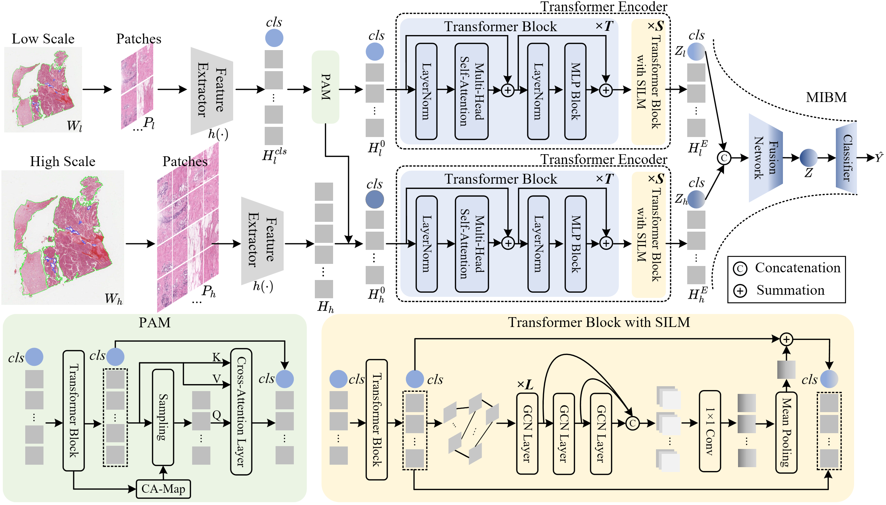

# MG-Trans: Multi-scale Graph Transformer with Information Bottleneck for Whole Slide Image Classification ([TMI 2023](https://ieeexplore.ieee.org/abstract/document/10244116))

Multiple instance learning (MIL)-based methods have become the mainstream for processing the megapixel-sized whole slide image (WSI) with pyramid structure in the field of digital pathology. The current MIL-based methods usually crop a large number of patches from WSI at the highest magnification, resulting in a lot of redundancy in the input and feature space. Moreover, the spatial relations between patches can not be sufficiently modeled, which may weaken the model's discriminative ability on fine-grained features. To solve the above limitations, we propose a Multi-scale Graph Transformer (MG-Trans) with information bottleneck for whole slide image classification. MG-Trans is composed of three modules: patch anchoring module (PAM), dynamic structure information learning module (SILM), and multi-scale information bottleneck module (MIBM). Specifically, PAM utilizes the class attention map generated from the multi-head self-attention of vision Transformer to identify and sample the informative patches. SILM explicitly introduces the local tissue structure information into the Transformer block to sufficiently model the spatial relations between patches. MIBM effectively fuses the multi-scale patch features by utilizing the principle of information bottleneck to generate a robust and compact bag-level representation. Besides, we also propose a semantic consistency loss to stabilize the training of the whole model. Extensive studies on three subtyping datasets and seven gene mutation detection datasets demonstrate the superiority of MG-Trans.



# Pre-requisites

Python (3.7.7), h5py (2.10.0), matplotlib (3.1.1), numpy (1.18.1), opencv-python (4.1.1), openslide-python (1.1.1), openslide (3.4.1), pandas (1.1.3), pillow (7.0.0), PyTorch (1.6.0), scikit-learn (0.22.1), scipy (1.4.1), tensorflow (1.13.1), tensorboardx (1.9), torchvision (0.7.0), captum (0.2.0), shap (0.35.0), torch_geometric (1.6.3).

# Dataset

* The TCGA datasets can be downloaded at [TCGA datasets](https://portal.gdc.cancer.gov/).
* The BRIGHT dataset can be downloaded at [BRIGHT Challenge](https://research.ibm.com/haifa/Workshops/BRIGHT/).

# Prepare dataset file

After downloading the required dataset, please prepare a dataset file (*e.g.*, 'BRIGHT_subtyping_three.csv') in the following format and put it into the 'dataset_csv' folder:

* The headname is 'case_id, slide_id, label'.
* For each line, taking the 'BRIGHT' dataset as an example, the value is organized as 'patient_0, BRACS_1786, Non-cancerous'.

# Data preprocessing

## Crop patches from WSI

Run the following scripts, the patches will be cropped based on the sliding window methods.

```
bash scripts/create_patches.sh 
```

--source: It's the path of the original WSI; you should define it by yourself.

## Extract patch features

Run the following scripts, the patch features will be extracted based on the pre-defined encoder (like ResNet50).

```
bash feature_extraction/patch_extraction.sh
```

--library_path: It's the save path of patch features; you should define it by yourself.

# Split Datasets

Run the following scripts, five-fold train/validation/test dataset splits will be generated.

```
bash scripts/creat_splits.sh
```

# Traning

```
bash scripts/train_MG_Trans_BRIGHT_cls3.sh
```

# Validation

```
bash scripts/eval_MG_Trans_BRIGHT.sh
```

# Citation

If you find our work useful in your research, please consider citing our paper at:

```
@article{shi2023mg,
  title={MG-Trans: Multi-scale Graph Transformer with Information Bottleneck for Whole Slide Image Classification},
  author={Shi, Jiangbo and Tang, Lufei and Gao, Zeyu and Li, Yang and Wang, Chunbao and Gong, Tieliang and Li, Chen and Fu, Huazhu},
  journal={IEEE Transactions on Medical Imaging},
  year={2023},
  publisher={IEEE}
}
```

# Acknowledgement

We have great thanks to the projects of [CLAM](https://github.com/mahmoodlab/CLAM), [Patch_GCN](https://github.com/mahmoodlab/Patch-GCN), and [Self-Supervised-ViT-path](https://github.com/Richarizardd/Self-Supervised-ViT-Path).
